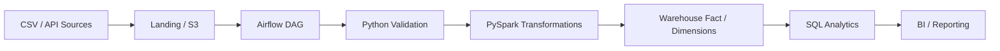

# Architecture

## Reliability
- Idempotent order processing using `order_id` as the business key.
- Schema validation before transformation.
- Invalid timestamps are quarantined by the transformation layer.
- CI executes automated tests on every push.
